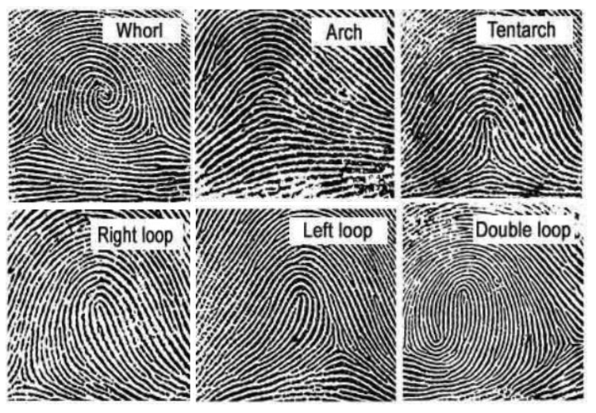

<h2 align="center">PENGENALAN SIDIK JARI</h2>

Mata kuliah : Pemrosesan Citra Digital

Dosen Pengampu : 
* Dr. Harja Santanapurba, M.Kom
* Novan Alkaf B. S. S.Kom., M.T
  
Anggota kelompok: 
* [Maisya Puspita Sari](https://github.com/maisyaapuspitaa)
* [Nurhaliza](https://github.com/nurhalizach)
  
  ---
#### 1. Pengertian pengenalan sidik jari

Sidik jari adalah representasi dari tonjolan dermal jari. Tonjolan Dermal terbentuk melalui kombinasi faktor genetik dan lingkungan; kode genetik dalam DNA memberikan instruksi umum tentang bagaimana seharusnya kulit terbentuk pada janin yang sedang berkembang, tetapi cara spesifik pembentukannya adalah hasil dari peristiwa acak seperti posisi yang tepat dari janin di dalam rahim pada saat tertentu. Inilah alasan mengapa sidik jari kembar identik pun berbeda. Sidik jari sepenuhnya terbentuk pada sekitar 7 bulan perkembangan janin. 

Sidik jari adalah salah satu dari teknik biometrik yang efektif. Sistem biometrik adalah sistem yang mengukur satu atau lebih karakteristik fisik atau perilaku, termasuk sidik jari, sidik telapak tangan, wajah, iris, retina, suara, tanda tangan, atau informasi DNA seseorang untuk menentukan atau memverifikasi identitasnya. Karakteristik ini disebut dengan istilah yang berbeda seperti ciri, indikator, pengidentifikasi, atau modalitas.

Pengenalan sidik jari (fingerprint recognition) merupakan teknologi yang amat sering dan umum digunakan oleh khalayak ramai dalam identifikasi identitas seseorang, bahkan telah menjadi teknologi yang cukup diandalkan karena efektifitas dan penggunaannya yang mudah. Sidik jari (fingerprint) adalah hasil reproduksi tapak jari baik yang sengaja diambil, di capkan dengan tinta, maupun bekas yang ditinggalkan pada benda karena pernah tersentuh dengan kulit telapak tangan atau kaki. Karena keunikannya itulah sidik jari (fingerprint) dapat digunakan untuk menjadi identitas utama yang digunakan dalam mengenali seseorang.

#### 2. Sejarah Penggunaan Sidik Jari

Menurut Xiang-Xin dan Chun-Ge (1988:277), tembikar yang diperkirakan berumur 6000 tahun ditemukan di tempat akeologi di barat laut Cina dan ditemukan menghasilkan jejak yang dapat dilihat dengan jelas daerah gesekan (friction ridge). Cetakan ini diperkirakan sebagai jejak kulit daerah gesekan (friction ridge) tertua yang ditemukan. Bagaimanapun, tidak diketahui apakah benda tersebut disimpan secara tidak sengaja atau dengan maksud spesifik, seperti untuk menciptakan pola dekoratif atau simbol.

Cina merupakan kebudayaan pertama yang diketahui menggunakan jejak ridge  sebagai identifikasi. Contoh paling pertama datang dari dokumentasi Cina yang berjudul “The Volume of Crime Scene Investigation – Burglary”, dari dinasti Qin (221-206 SM). Dokumen tersebut berisi deskripsi dari bagaimana sidik jari digunakan sebagai bukti. Contoh paling umum dari penggunaan sidik jari adalah pada cap tanah liat. Setelah ditemukan kertas oleh orang Cina, penggunaan sidik jari untuk menandatangani dokumen menjadi umum.

Menurut Ashbaugh (1999:38), sejak abad ke-17 ilmuwan  Eropa mulai mempublikasikan percakapan mereka tentang kulit manusia. Sidik jari pertama kali dideskripsikan secara terperinci oleh Dr. Nehemiah Grew pada makalah tahun 1684 berjudul “Philosophical Transactions of the Royal Society of London”. 

Walaupun sidik jari telah dipelajari selama bertahun – tahun, baru pada tahun 1788 dikenal keunikan dari sidik jari ini di Eropa. Welker mulai mencetak tangan kanannya sendiri pada tahun 1856 dan kemudian pada tahun 1897, sehingga mendapatkan predikat sebagai orang pertama yang memulai pembelajaran sidik jari secara permanen. Menurut Lambourne (1984:58-59), kasus pembunuhan Rojas adalah kasus pembunuhan pertama yang diselesaikan dengan bukti sidik jari, dan Argentina menjadi negara perama yang mengandalkan sidik jari sebagai metode individualisasi.

Menurut Myers (1942:18), bencana pertama Amerika Serikat dimana individualisasi sidik jari berperan utama ketika USS Squalus tenggelam pada 23 Mei 1939. Kapal selam tersebut tenggelam ke dasar laut dengan kedalaman 240 kaki. James Herbert Taylor, pempimpin di divisi identifikasi angkatan laut Amerika Serikat, melakukan operasi identifikasi. Semua mayat diidentifikasi menggunakan sidik jari.

#### 7. Jenis Jenis Sensor pengenalan sidik jari
Ada empat jenis utama perangkat keras pembaca sidik jari:
1. Pembaca optik, adalah jenis pembaca sidik jari yang paling umum. Jenis sensor dalam pembaca optik adalah kamera digital yang memperoleh citra visual sidik jari. Keuntungannya adalah pembaca optik di mulai dengan harga yang sangat murah. Kekurangannya adalah pembacaan dipengaruhi oleh jari yang kotor atau bekas luka, dan jenis pembaca sidik jari ini lebih mudah dipalsukan daripada yang lain.
2. Pembaca kapasitif, juga disebut sebagai pembaca CMOS, tidak membaca sidik jari menggunakan cahaya. Sebaliknya pembaca CMOS menggunakan kapasitor dan dengan demikian arus listrik untuk membentuk gambar sidik jari. Pembaca CMOS lebih mahal daripada pembaca optik. Keuntungan penting dari pembaca kapasitif dibandingkan pembaca optik adalah bahwa pembaca kapasitif membutuhkan bentuk sidik jari yang nyata daripada hanya gambar visual. Ini membuat pembaca CMOS lebih sulit untuk ditipu.
3. Pembaca ultrasound, adalah jenis pembaca sidik jari terbaru, mereka menggunakan gelombang suara frekuensi tinggi untuk menembus lapisan epidermis (luar) kulit. alat tersebut membaca sidik jari pada lapisan kulit dermal, yang menghilangkan kebutuhan akan permukaan yang bersih dan tanpa bekas luka. Semua jenis pembaca sidik jari lainnya memperoleh gambar permukaan luar, sehingga membutuhkan tangan bersih dan bebas dari bekas luka sebelum dibaca. Jenis pembaca sidik jari ini jauh lebih mahal daripada dua yang pertama, namun karena akurasinya dan fakta bahwa mereka sulit ditipu, pembaca ultrasound sudah sangat populer.
4. Pembaca termal, pada permukaan kontak, perbedaan suhu di antara punggung dan lembah sidik jari. Pembaca sidik jari termal memiliki sejumlah kelemahan seperti konsumsi daya yang lebih tinggi dan kinerja yang bergantung pada suhu lingkungan.
