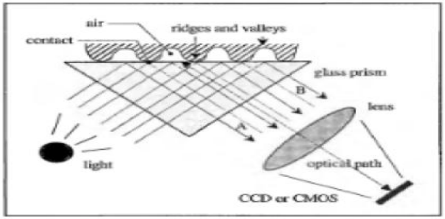

<h2 align="center">PENGENALAN SIDIK JARI</h2>

Mata kuliah : Pemrosesan Citra Digital

Dosen Pengampu : 
* Dr. Harja Santanapurba, M.Kom
* Novan Alkaf B. S. S.Kom., M.T
  
Anggota kelompok: 
* [Maisya Puspita Sari](https://github.com/maisyaapuspitaa)    2110131320006
* [Nurhaliza](https://github.com/nurhalizach)  2110131120007
  
  ---
#### 1. Pengertian pengenalan sidik jari

Sidik jari adalah representasi dari tonjolan dermal jari. Tonjolan Dermal terbentuk melalui kombinasi faktor genetik dan lingkungan; kode genetik dalam DNA memberikan instruksi umum tentang bagaimana seharusnya kulit terbentuk pada janin yang sedang berkembang, tetapi cara spesifik pembentukannya adalah hasil dari peristiwa acak seperti posisi yang tepat dari janin di dalam rahim pada saat tertentu. Inilah alasan mengapa sidik jari kembar identik pun berbeda. Sidik jari sepenuhnya terbentuk pada sekitar 7 bulan perkembangan janin. 

Sidik jari adalah salah satu dari teknik biometrik yang efektif. Sistem biometrik adalah sistem yang mengukur satu atau lebih karakteristik fisik atau perilaku, termasuk sidik jari, sidik telapak tangan, wajah, iris, retina, suara, tanda tangan, atau informasi DNA seseorang untuk menentukan atau memverifikasi identitasnya. Karakteristik ini disebut dengan istilah yang berbeda seperti ciri, indikator, pengidentifikasi, atau modalitas.

Pengenalan sidik jari (fingerprint recognition) merupakan teknologi yang amat sering dan umum digunakan oleh khalayak ramai dalam identifikasi identitas seseorang, bahkan telah menjadi teknologi yang cukup diandalkan karena efektifitas dan penggunaannya yang mudah. Sidik jari (fingerprint) adalah hasil reproduksi tapak jari baik yang sengaja diambil, di capkan dengan tinta, maupun bekas yang ditinggalkan pada benda karena pernah tersentuh dengan kulit telapak tangan atau kaki. Karena keunikannya itulah sidik jari (fingerprint) dapat digunakan untuk menjadi identitas utama yang digunakan dalam mengenali seseorang.

#### 2. Sejarah Penggunaan Sidik Jari

Menurut Xiang-Xin dan Chun-Ge (1988:277), tembikar yang diperkirakan berumur 6000 tahun ditemukan di tempat akeologi di barat laut Cina dan ditemukan menghasilkan jejak yang dapat dilihat dengan jelas daerah gesekan (friction ridge). Cetakan ini diperkirakan sebagai jejak kulit daerah gesekan (friction ridge) tertua yang ditemukan. Bagaimanapun, tidak diketahui apakah benda tersebut disimpan secara tidak sengaja atau dengan maksud spesifik, seperti untuk menciptakan pola dekoratif atau simbol.

Cina merupakan kebudayaan pertama yang diketahui menggunakan jejak ridge  sebagai identifikasi. Contoh paling pertama datang dari dokumentasi Cina yang berjudul “The Volume of Crime Scene Investigation – Burglary”, dari dinasti Qin (221-206 SM). Dokumen tersebut berisi deskripsi dari bagaimana sidik jari digunakan sebagai bukti. Contoh paling umum dari penggunaan sidik jari adalah pada cap tanah liat. Setelah ditemukan kertas oleh orang Cina, penggunaan sidik jari untuk menandatangani dokumen menjadi umum.

Menurut Ashbaugh (1999:38), sejak abad ke-17 ilmuwan  Eropa mulai mempublikasikan percakapan mereka tentang kulit manusia. Sidik jari pertama kali dideskripsikan secara terperinci oleh Dr. Nehemiah Grew pada makalah tahun 1684 berjudul “Philosophical Transactions of the Royal Society of London”. 

Walaupun sidik jari telah dipelajari selama bertahun – tahun, baru pada tahun 1788 dikenal keunikan dari sidik jari ini di Eropa. Welker mulai mencetak tangan kanannya sendiri pada tahun 1856 dan kemudian pada tahun 1897, sehingga mendapatkan predikat sebagai orang pertama yang memulai pembelajaran sidik jari secara permanen. Menurut Lambourne (1984:58-59), kasus pembunuhan Rojas adalah kasus pembunuhan pertama yang diselesaikan dengan bukti sidik jari, dan Argentina menjadi negara perama yang mengandalkan sidik jari sebagai metode individualisasi.

Menurut Myers (1942:18), bencana pertama Amerika Serikat dimana individualisasi sidik jari berperan utama ketika USS Squalus tenggelam pada 23 Mei 1939. Kapal selam tersebut tenggelam ke dasar laut dengan kedalaman 240 kaki. James Herbert Taylor, pempimpin di divisi identifikasi angkatan laut Amerika Serikat, melakukan operasi identifikasi. Semua mayat diidentifikasi menggunakan sidik jari.

#### 3. Cara Kerja Fingerprint

Dibawah ini merupakan struktur umum dari scanner sidik jari dimana sebuah sensor membaca permukaan jari dan merubah pembacaan analog kedalam digital melalui sebuah A/D konverter (Analog ke Digital), sebuah modul interface bertanggung jawab untuk berkomunikas (mengirim gambar, menerima perintah, dan sebagainya) dengan alat luar (personal computer / PC).

Jari menyentuh sisi atas dari kaca prisma, tapi ridges mulai bersentuhan dengan permukaan prisma, bekas valley pada jarak pasti. Pada sisi kiri prisma menerangi melalui suatu cahaya yang menyebar. Cahaya masuk ke prisma dicerminkan pada valley, dan secara acak  menyebar (menyerap) pada ridges. Pantulan yang kurang memberikan ridges menjadi berbeda-beda dari valleys. Sinar cahaya keluar dari sisi kanan prisma dan fokus melaui lensa diatas CCD atau CMOS sensor gambar. Karena alat FTIR berguna untuk permukaan 3 dimensi, ini tidak dapat dengan mudah menipu pemberian foto atau cetak gambar dari sidik jari. Ketika jari sangat kering, itu tidak dapat membuat kontak yang sama dengan permukaan sensor. Memperbaiki pembentukan sidik jari dari jari yang kering yang mana ridge tidak mengandung partikel keringat, beberapa penghasil scanner menggunakan lapisan 
silikon yang menyerupai kontak dari permukaan dengan prisma. Dengan tujuan mengurangi biaya dari alat optik, plastik pada saat sekarang sering kali digunakan dibandingkan kaca prisma, dan lensa. 

Dimana seperti pada percobaan Newton menjelaskan bahwa cahaya putih 
(polikromatis) bila dilewatkan terhadap prisma akan mengalami gejala disperse yaitu gejala peruraian cahaya putih menjadi cahaya monokromatik (merah, jingga, kuning, hijau, biru, nila, dan ungu), cahaya-cahaya ini memiliki panjang gelombang yang berbeda. Setiap panjang gelombang memiliki indeks bias yang berbeda. Semakin kecil panjang gelombangnya semakin besar indeks biasnya. Dispersi pada prisma terjadi karena adanya perbedaan indeks bias kaca setiap warna cahaya Menggunakan lembaran prima membuat angka dari “primslets” 
berdampingan. Dibandingkan dari prisma satu yang besar, membolehkan ukuran dari kumpulan mesin untuk dikurangi beberapa tingkat. Sesungguhnya sekalipun sisa lintasan optik sama, lembaran prisma hampir datar. Bagaimanapun, kualitas dari perolehan gambar secara umum rendah dibandingkan teknik tradisional FTIR menggunakan kaca prisma.

Proses pencocokan sidik jari adalah melalui beberapa tahap diantaranya: 
1. Proses pendeteksian titik referensi 
2. Penentuan titik ROI
3. Sektorisasi 
4. Normallisasi
5. Proses penghitungan vector ciri 
6. Pencocokan Sidik Jari

#### 4. Fungsi *Fingerprint
Fingerprint pada umumnya memiliki fungsi seperti kata sandi dan pola yaitu untuk menjamin keamanan dan berfungsi sebagai media verifikasi, hanya saja media verifikasi yang digunakan pada teknologi fingerprint adalah sidik jari manusia itu sendiri yang tidak mudah untuk dipalsukan dan diakses oleh orang lain. Berikut ini merupakan beberapa fungsi fingerprint:
1. **Fingerprint untuk membuka smartphone**
   Sistem perlindungan ponsel klasik selalu berupa kode sandi empat digit. Ini bukan metode otentikasi yang aman, terutama sekarang karena kami menyimpan lebih banyak barang di dalam ponsel kami (kartu kredit, akses bank, media sosial, dll). Baik sidik jari maupun pengenalan wajah sekarang banyak digunakan di ponsel.
2. **Fingerprint untuk melakukan absensi**
   Sensor fingerprint biasanya juga berfungsi sebagai alat absensi pada karyawan di berbagai perusahaan tertentu. Penggunaan sensor fingerprint dinilai tidak dapat dipalsukan dan tidak dapat diwakilkan sehingga rasa tanggung jawab dan disiplin para karyawan lebih meningkat.
3. **Fingerprint untuk membuka pintu**
   Cara biasa untuk masuk ke kamar adalah dengan menggunakan kunci, yang memiliki kelemahan mudah hilang atau dicuri.Berkat biometrik sidik jari, anda bisa menggunakan sidik jari anda untuk membuka kunci pintu sehingga tingkat keamanan akan lebih tinggi.
4. **Fingerprint untuk melakukan pembayaran**
   Masalah di Uni Eropa adalah tidak ada database publik untuk mencocokkan sidik jari dan memverifikasi identitas seseorang secara real time. Namun, ada beberapa negara di Amerika Latin di mana, karena tingkat penipuan dan penipuan yang tinggi, mereka mengizinkan pencocokan ini dilakukan dan ada perusahaan yang mengkhususkan diri dalam hal ini.Akibatnya, sekarang dimungkinkan untuk menggunakan sidik jari Anda sebagai metode pembayaran, tanpa perlu membawa uang tunai atau kartu kredit. Sistem ini diterapkan dua tahun lalu di Venezuela, ideal untuk kasus ini karena pengenalan biometrik sebelumnya telah digunakan, misalnya dalam pemungutan suara elektronik atau identifikasi di ATM.
5. **Fingerprint digunakan sebagai alat bukti yang sah dalam verifikasi identitas**
   Sidik jari dapat digunakan untuk memverifikasi identitas orang tersebut dalam proses penandatanganan untuk memberikan keamanan yang lebih besar dan validitas hukum untuk kontrak yang bersangkutan. Tujuan dari pembuktian hukum adalah untuk mengamankan seluruh proses. Untuk itu, disarankan untuk menambahkan beberapa bukti hukum untuk memperkuat proses ini, seperti sidik jari atau SMS OTP yang dikirimkan ke ponsel penanda tangan.Sidik jari digunakan untuk memastikan identifikasi individu yang sempurna, karena unik dan tidak dapat ditransfer. Dengan demikian, memenuhi persyaratan untuk dianggap sebagai tanda tangan elektronik tingkat lanjut, sepenuhnya legal.

   
   
#### 5. Kelebihan *Fingerprint*
1. **Memiliki tingkat keamanan yang tinggi**
   Tidak semua orang di dunia memiliki pola yang sama pada sidik jarinya. Jika Anda menggunakan sistem keamanan sidik jari, Anda dapat yakin bahwa sistem keamanan tetap terjaga karena hanya Anda yang dapat mengaksesnya.
   
2. **Privasi data menjadi lebih aman**
   Beberapa smartphone yang memasang fitur fingerprint juga dapat Anda gunakan untuk mengakses beberapa data atau dokumen penting yang ada pada smartphone. Data-data atau dokumen penting tersebut akan tersimpan lebih aman karena hanya Anda yang dapat membukanya.

#### 6. Kekurangan *Fingerprint*
1. **Memungkinkan adanya duplikasi jari**
   Sidik jari seseorang memang sangat sulit untuk ditiru atau diduplikasi, namun bukan tidak mungkin jika sidik jari Anda dapat diduplikasi oleh orang lian. Oleh karena itu Anda juga perlu berhati-hati karena pada saat ini beberapa cara dapat dilakukan untuk menggandakan sidik jari seseorang. Misalnya dengan mengambil gambar pola sidik jari orang lain dan mencetaknya dalam resolusi tinggi.

2. **Bersifat Permanen**
   Sidik jari yang Anda gunakan pada smartphone Anda secara otomatis akan langsung tersimpan dan tidak dapat diubah atau bersifat permanen. Maka secara otomatis apabila sidik jari Anda berhasil dicuri atau diduplikasi oleh orang yang tak bertanggung jawab, maka orang tersebut akan bebas mengakses semua data yang ada pada smartphone Anda.

#### 7. Jenis Jenis Sensor pengenalan sidik jari
Ada empat jenis utama perangkat keras pembaca sidik jari:
1. Pembaca optik, adalah jenis pembaca sidik jari yang paling umum. Jenis sensor dalam pembaca optik adalah kamera digital yang memperoleh citra visual sidik jari. Keuntungannya adalah pembaca optik di mulai dengan harga yang sangat murah. Kekurangannya adalah pembacaan dipengaruhi oleh jari yang kotor atau bekas luka, dan jenis pembaca sidik jari ini lebih mudah dipalsukan daripada yang lain.
2. Pembaca kapasitif, juga disebut sebagai pembaca CMOS, tidak membaca sidik jari menggunakan cahaya. Sebaliknya pembaca CMOS menggunakan kapasitor dan dengan demikian arus listrik untuk membentuk gambar sidik jari. Pembaca CMOS lebih mahal daripada pembaca optik. Keuntungan penting dari pembaca kapasitif dibandingkan pembaca optik adalah bahwa pembaca kapasitif membutuhkan bentuk sidik jari yang nyata daripada hanya gambar visual. Ini membuat pembaca CMOS lebih sulit untuk ditipu.
3. Pembaca ultrasound, adalah jenis pembaca sidik jari terbaru, mereka menggunakan gelombang suara frekuensi tinggi untuk menembus lapisan epidermis (luar) kulit. alat tersebut membaca sidik jari pada lapisan kulit dermal, yang menghilangkan kebutuhan akan permukaan yang bersih dan tanpa bekas luka. Semua jenis pembaca sidik jari lainnya memperoleh gambar permukaan luar, sehingga membutuhkan tangan bersih dan bebas dari bekas luka sebelum dibaca. Jenis pembaca sidik jari ini jauh lebih mahal daripada dua yang pertama, namun karena akurasinya dan fakta bahwa mereka sulit ditipu, pembaca ultrasound sudah sangat populer.
4. Pembaca termal, pada permukaan kontak, perbedaan suhu di antara punggung dan lembah sidik jari. Pembaca sidik jari termal memiliki sejumlah kelemahan seperti konsumsi daya yang lebih tinggi dan kinerja yang bergantung pada suhu lingkungan.
